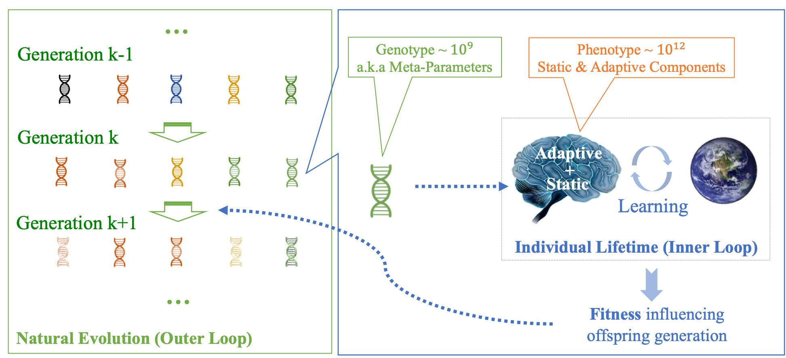
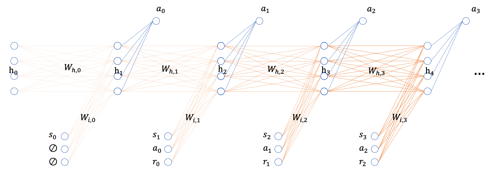
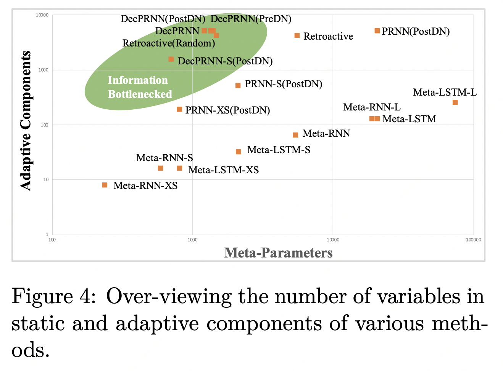
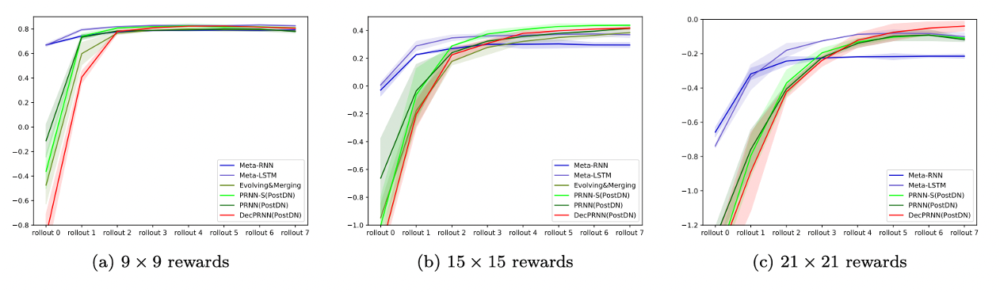

[Paper](https://arxiv.org/abs/2109.03554) [Code](https://github.com/WorldEditors/EvolvingPlasticANN)

**从参数规模化转向记忆规模化**

---

<iframe src="//player.bilibili.com/player.html?bvid=BV1ce4y1k7DN&page=1" scrolling="no" border="0" frameborder="no" framespacing="0" allowfullscreen="true"> </iframe>

---

# 什么是生物神经网络的信息瓶颈？它与神经网络的可塑性有何关系？

信息瓶颈是生物神经网络的一个重要特征。在生物进化过程中，基因所承载的信息量，相较于高等动物（如人类）大脑的复杂性而言，显得极为有限。这一现象为人工智能带来了重要启示：由于信息瓶颈的存在，生物神经网络无法直接从上一代遗传大量的技能和知识，而是需要通过后天重新学习。基因主要编码的是记忆和学习的能力，而非记忆和技能本身。

人类学习和记忆能力的一个重要实现方式便是**神经网络可塑性**。与当前的人工神经网络不同——后者在预训练后权重难以调整，且每次调整都依赖目标函数和大量数据，并通过梯度下降完成——可塑性使得神经网络在推理过程中能够同时修正自身权重，体现出无梯度上下文学习和元学习的某些特征。然而，现有的人工设计可塑性规则大多不符合**信息瓶颈**的特征，往往需要比参数数量更多的学习规则。

我们尝试设计符合信息瓶颈的可塑性规则。这类模型在初始阶段不具备很强的能力，但随着上下文信息的增加，其表现会逐步提升。其典型特点是参数量少、记忆能力强。这种学习方式更贴近生物智能体的特点：婴儿阶段起点更低，但上下文学习的潜力更大。

*信息瓶颈限制下的生物进化示意图。我们的基因遗传自上一代，其所包含的信息量相对较少（即 Genotype），而我们大脑的记忆全部来源于后天，其可记忆的内容数量至少比基因高出三个数量级（即 Phenotype）。*

# 进化一个规则较少、具备可塑性的循环神经网络

我们考虑采用了一种参数量极少（学习规则仅数百个）、但记忆空间较大（记忆状态达数千个）的可塑性循环神经网络（Decomposed Plastic RNN, DecPRNN），进行上下文强化学习，并在迷宫环境中进行了训练与评估。我们得出以下重要结论：

- **更少的参数意味着更低的起点**
- **更大的记忆空间意味着更高的终点**
- **参数量与最终能力并无直接关联，甚至在参数量更少的情况下，模型的泛化能力更强**

*一个具备可塑权重参数的循环神经网络，利用交互轨迹进行上下文强化学习。模型在每一步将状态、动作和奖励作为输入，预测下一时刻的动作。*

*不同神经网络的参数（元参数，Meta-Parameter）与记忆规模（自适应组件，Adaptive-Components）。我们发现，参数量较小的模型具有更好的泛化性，而记忆空间越大的模型则具备更强的学习能力。*

*不同神经网络的最终表现。符合基因瓶颈的结构与算法，起点虽低，但最终效果更优。*

# 对通用智能的启示

这里主要想给出一种未来AGI研发的可能路径，即不过分强调海量参数。适中的参数量，搭配海量的可读写记忆单元，对于构建通用人工智能具有更广阔的前景。这里的记忆单元，既包括模型通过上下文学习到的显式记忆（如记忆状态），也包括隐式记忆（如可塑的连接权重）。此外，我们认为，通过多个重复单元的组合，可以在降低参数量的同时进一步扩展记忆空间，因此群聚智能也将成为一个极具潜力的研究方向。