[Paper](https://arxiv.org/abs/2405.17234) [Code](https://github.com/FutureAGI/Xenoverse)

*世界模型与迷宫世界模拟器：上半部分为真实情况，下半部分为模型预测。*

## 什么是通用上下文学习？为什么要强调它？

我们认为，大模型智能涌现的核心能力包括两方面：

-   **零样本泛化 (Zero-shot Generalization)**：模型能够将其在训练过程中学习到的所有数据和知识，记忆在参数空间，并利用这些知识进行推理泛化以解决问题。
-   **小样本上下文学习 (Few-shot In-Context Learning)**：模型更进一步，能够通过提示（Prompt）信息，掌握在训练时完全没有见过的数据或技能。

上下文学习通常具备一些优良特性，包括：使用极少样本（相比梯度下降少得多的样本）就能学习一项新技能；对学习方式不敏感，很多时候甚至不必给正样本，仅通过提示信息告诉模型什么是错的，也能辅助学习（即可以涵盖传统意义上的监督学习、强化学习、无监督学习）；对噪音不敏感，即使提示中包含模糊信息，模型依旧可以正确执行任务。这些特性使得模型具备了泛化到非常广泛任务的潜力。

然而，当前的上下文学习还存在明显的局限性：其样本量通常不多（往往只有少量示例），且常常被限制在“指令跟随”层面，无法在上下文内部进行反复尝试和优化的复杂过程（如强化学习）。此外，尽管近期大模型能编码的上下文长度在不断增长，但需要注意的是，很多上下文编码并非真正的“学习”过程，而大多是简单的复制、召回特定内容等任务。

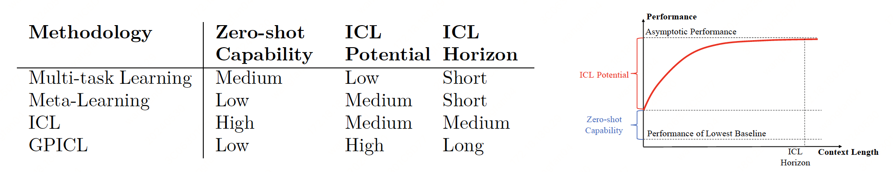
*通用上下文学习定义及其与其他学习方法的区别*

我们认为，为了实现真正的通用人工智能，有必要将上下文学习扩展为**通用上下文学习（General Purpose In-Context Learning， GPICL）**。相较于其他方法，GPICL具有以下显著特征：

-   **最低归纳偏倚与低零样本泛化能力 (Minimal Inductive Bias and Low Zero-shot Generalization)**。
-   **长上下文学习周期 (Long In-Context Learning Horizon)**。
-   **高上下文学习天花板 (High In-Context Learning Potential)**。

尽管提升上下文学习的上限和长度已成为共识，但将“降低零样本能力”作为目标显得有些反直觉，原因何在？我们认为，零样本泛化能力与数据的多样性呈反向关系：零样本泛化能力越强，反而越说明训练模型所用的样本和任务多样性有限，导致模型保留了过多与特定任务或任务范围相关的知识，这进一步限制了其泛化到任务范围之外的能力。

因此，我们认为，合适的任务集合是帮助AI学习到通用上下文学习能力的关键。所以，降低零样本泛化能力的目标，并非是要让模型在一个固定的训练集中学不到样本中的知识，而是 **“我们需要采用尽可能多样的训练集，这种多样性足以使模型无法对任务学习到任何预先的假设”**。

## 通用上下文学习评测集的要求

基于上述原因，我们认为建立适合于通用上下文学习（GPICL）的训练和评测任务集至关重要。通用上下文学习，顾名思义，旨在泛化到更广泛的未见任务，甚至包括不同模态，而不要求这些任务或模态在预训练（或元训练）阶段被见过。具体而言，通用上下文学习需要满足以下几个标准：

-   **任务数量和任务多样性足够大**：大到任何模型都无法从任务集中学习到可用的零样本泛化知识，从而引导模型学习到最低的归纳偏倚（inductive bias）。如果任务数量多但多样性不足，模型很容易学到高零样本泛化能力，但上下文学习的潜力和必要性不强，且对任务集外的任务泛化能力可能欠缺。如果任务多样性足够大但数量不够多，模型则容易陷入“多任务学习”加“任务辨识”的陷阱：即模型在预训练时“记忆”下所有任务的完成方式和特点，推理时仅需少量上下文进行“任务辨识”就能很好完成任务。这两种情况都不会引导模型学习到真正的GPICL能力。
-   **终生上下文学习 (Lifelong In-Context Learning)**：模型需要依赖足够长的上下文，不是两三个，也不是二三十个样本，而是数百万甚至数十亿计量的上下文，才能完全掌握任务。这里的上下文长度，是在“理想的学习方法”下，所需的最小上下文长度。
-   **持续的生成和交互**：上下文是通过实时、不断生成和交互而产生的持续性样本。

## 元语言 (Meta-Language) 生成器

我们认为，相比于学习具体的自然语言，学习一种新语言的过程更符合GPICL的需求。然而，世界上常用的语言不过数百种，若将自然语言学习本身作为样本，其数量过于稀少。因此，一种理想的途径是创造近乎无数种类的“语言”。每种“语言”可视为一个超长序列的样本，模型通过上下文可以学会一种新的语言。

我们提出一种“创造”这种新“语言”的方法：使用随机参数的网络来生成随机序列。这种随机序列在相对较短时没有任何意义，但随着序列不断延长，生成该序列的内在规律可以被外部捕捉到。这种无限的“新语言”序列，是GPICL理想的试验场。

我们发现，Transformer模型可以捕捉这种随机序列并产生上下文学习能力。我们证明，这种上下文学习能力是一种通用的上下文学习能力。因为模型不仅能通过上下文掌握一种新的随机序列，而且，当我们把用随机序列预训练好的模型用于真正的自然语言任务时，发现它仍然具备学习能力——请注意，模型在预训练阶段完全没有使用任何自然语言序列进行学习。

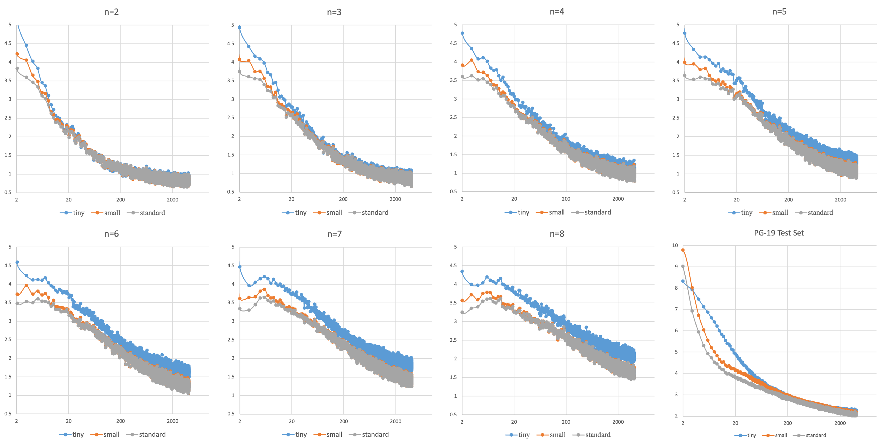
*元语言模型在不同复杂度元语言上的评测效果，最后PG-19是一个自然语言评测集。模型的表现随着上下文长度的增加而变好，即使是对未训练过的自然语言亦是如此，证明了元语言训练具有良好的泛用性。此外，几千万参数的模型继续扩大规模对效果并无帮助，证明GPICL并不总是需要巨大的参数量。*

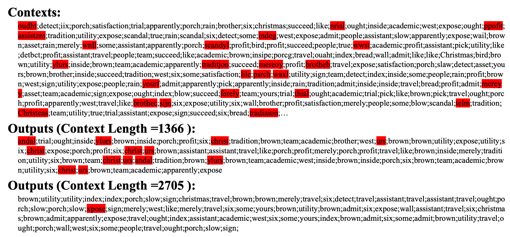
*元语言模型具备利用上下文学习完全未知数据的能力。此处模型学习英文单词，能够捕捉其规律。*

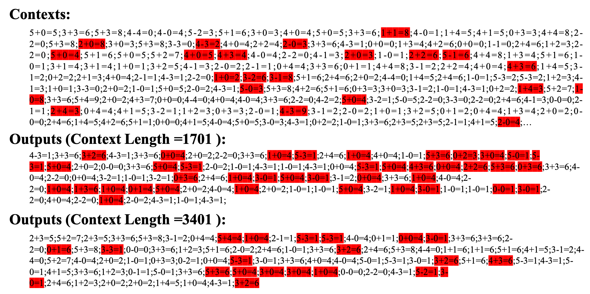
*元语言模型具备利用上下文学习完全未知数据的能力。此处模型学习数学等式，能够捕捉其规律。*

## 迷宫世界 (Maze World) 生成和模拟

迷宫世界是一个规则明确但多样性又足够显著的轻量级仿真环境。在其中，我们可以轻松定制大小、结构、墙面完全不同的迷宫。我们在该仿真环境中设置了导航（NAVIGATION）和生存（SURVIVAL）两类任务。以导航任务为例，我们会在迷宫中随机加入一定数量、各不相同的“地标”，这些地标随机产生于一个随机迷宫的不同位置。对于智能体，环境会产生随机指令，要求其尽快抵达特定颜色的地标。这要求智能体具备探索、记忆、定位、寻径的能力，以高效达成任务。并且，对于任何任务，由于迷宫和地标都是完全随机的，智能体除了依赖自身探索外，没有任何方式获取关于迷宫的先验信息。

除了环境本身，考虑到强化学习通常难以规模化，我们提供了可供模型进行模仿学习、从而快速热启动的“标杆智能体”。这类标杆智能体可以直接访问全局地图（但全局地图有限制，必须先看到才能记录），并能产生大量高质量数据，供模型直接模仿学习。

我们的实验结果证明，使用Transformer结构进行上下文学习，具备同时学习“世界模型”（World Model）和“策略模型”（Policy Model）的能力（据我们所知，这是第一个观察到世界模型ICL的工作）。但当前实验结果也表明，当前模型离理想状态（如较好的标杆智能体）仍有较大差距，因此存在巨大的优化空间。

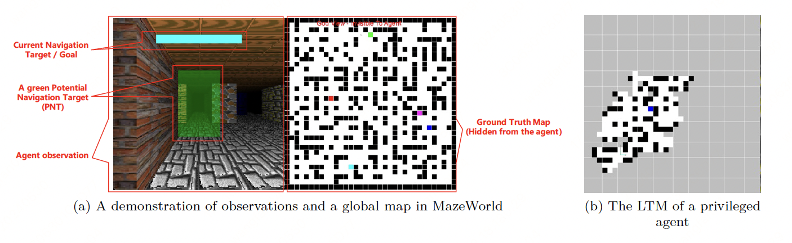
*迷宫世界环境和标杆智能体的地图记忆说明*

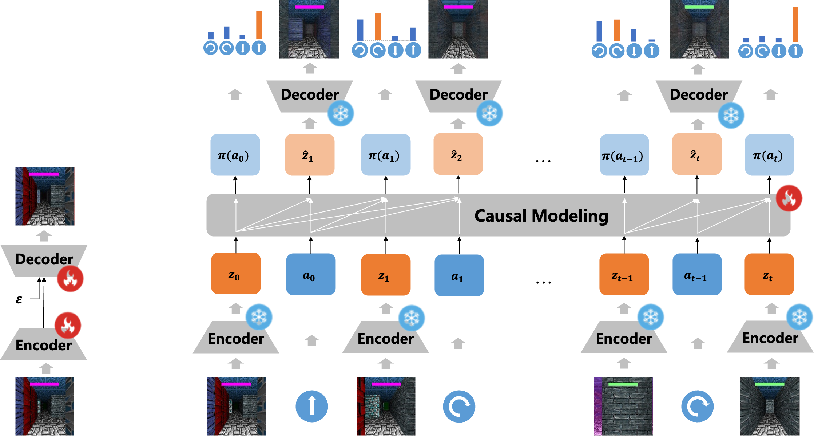
*世界模型和策略模型一体的迷宫导航模型*

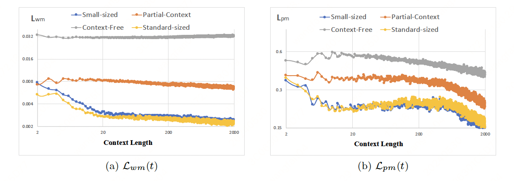
*评测中世界模型和策略模型显示出随上下文变长的自适应能力*

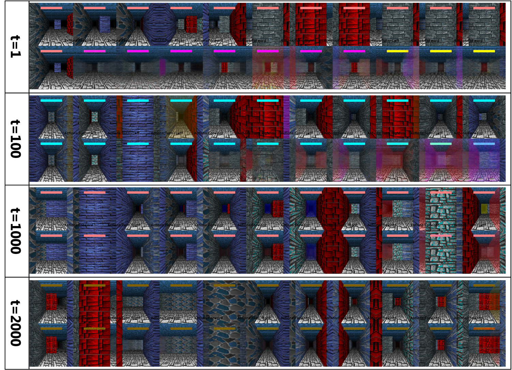
*利用上下文学习的世界模型在未来预测上变得越来越准确 (1)。上图为真实观测，下图为世界模型基于相同动作序列“想象”的未来9个时间步的预测。t表示模型利用的上下文长度。*

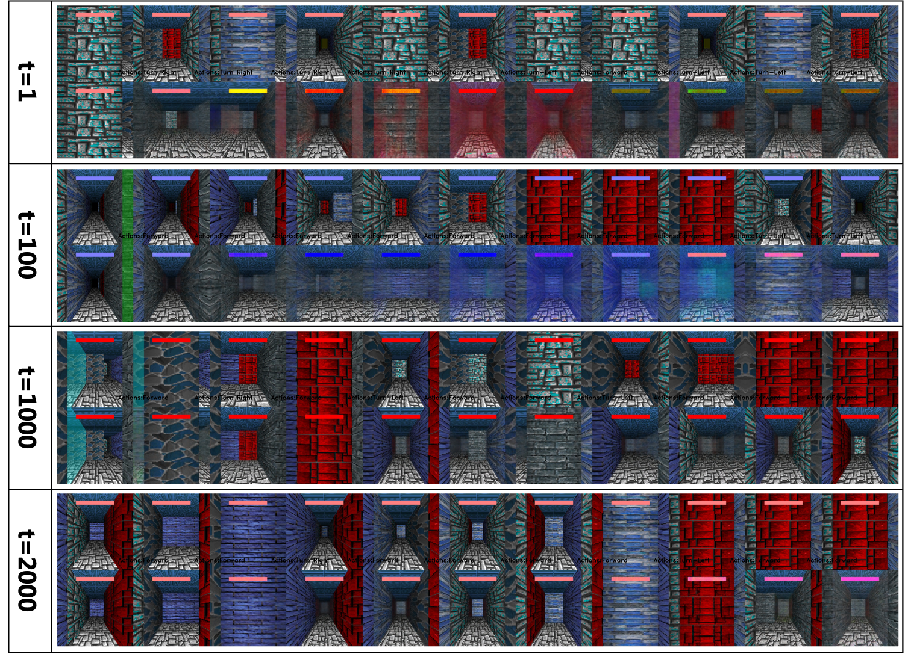
*利用上下文学习的世界模型在未来预测上变得越来越准确 (2)*

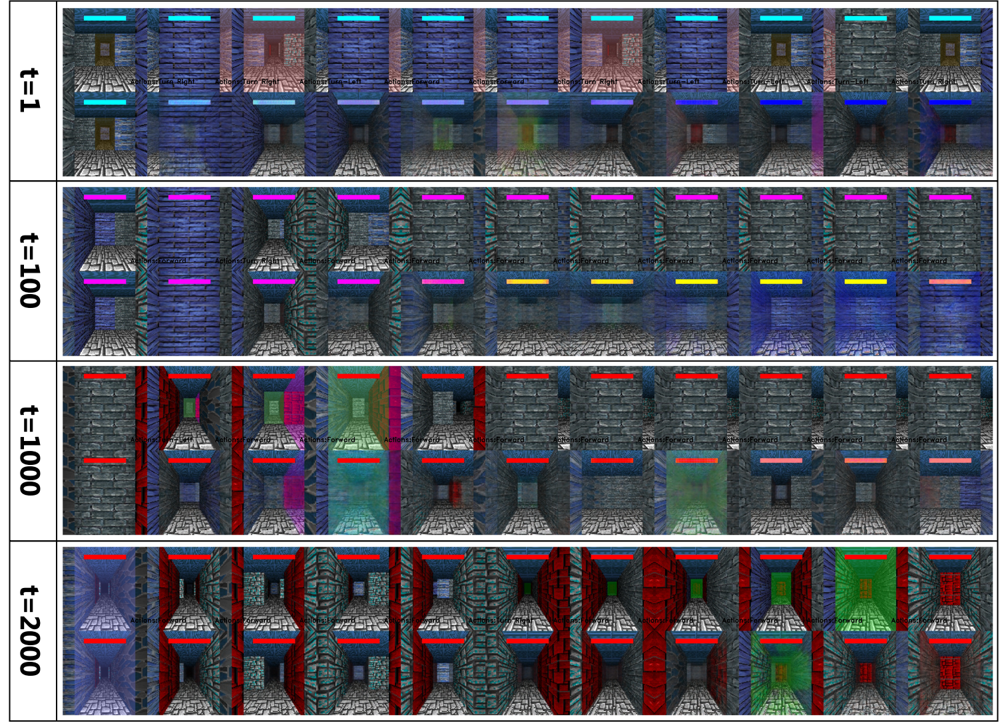
*利用上下文学习的世界模型在未来预测上变得越来越准确 (3)*

## 增加参数量还是增加记忆和上下文？

在上述两个环境中，尽管我们目前实现的上下文学习长度只到2K到4K，但可以通过修改配置，将上下文学习的最短长度扩展到百万甚至数十亿以上。我们相信，这类评测训练集对于长上下文学习以及通用上下文学习具有重要意义。此外，尽管这两个环境相对简单、轻量，但它们具有较大的研究意义：元语言的目标是训练具备语言学习和适应能力的通用智能体，而迷宫的目标是打造集未知环境探索、定位、导航能力于一体的通用具身智能体。

此外，我们的工作也应证了此前许多研究的发现：**上下文学习能力与模型参数规模关联性较弱**（当模型参数超过一定阈值后，其上下文学习能力不再增长），而与上下文以及记忆状态的规模存在正向强关联。这为我们揭示了一条不同于直接暴力增加参数规模的道路：**足够大的参数 + 大量记忆和上下文知识**。

基于此，我们还提出了一种有别于当前大语言模型的新颖训练方法：通过海量合成数据，训练模型的通用上下文学习能力，再通过小规模高质量数据，对齐模型与人类偏好。这与自然智能的产生过程更为相似：前者对应数十亿年的生命进化，后者则对应人类个体的一生。

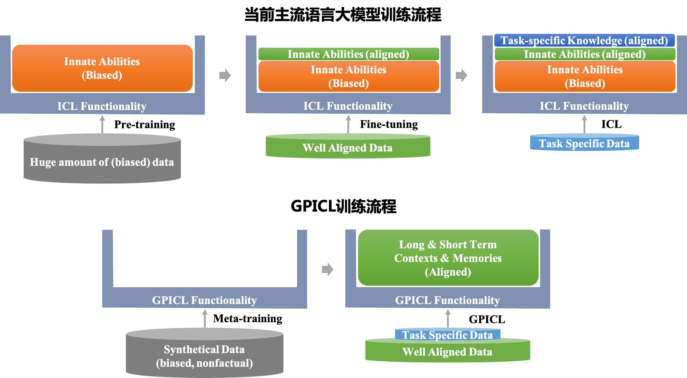
*通用上下文学习主导的大模型训练流程说明*